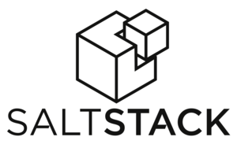

# Be Gru - Master of your Minions   with   

---

# self.about
- Tobias Paepke
- 1980
- Admin seit 1998
- Python seit 2000 (1.5)
- Web-dev seit 2010

---

# Was macht saltstack?

Programme entfernt ausführen

Definierten Zustand herstellen

Abrufen von Informationen

---
# Grundsätzliches

- deklarativ: Puppet, Chef, CFengine
- imperativ: ansible, fabric
- reale Welt: Salt kann beides

---

# Architektur

- Python
- via ZeroMQ
- via SSH
- Client/Server
- Serverlos
- Linux/Mac/BSD/Windows

---

# Begriffe

- Master - der Verwaltungsserver
- Minon - ein einzelner, zu steuernder Host
- Pillar - Daten über den Host / Anwendung
- Grains - erhobene oder definierte Daten des Minion
- Module - Ausfuehrbares Stück Code, meist auf Zielsystem
- State - Beschreibung wie etwas auf dem Zielsystem aussehen muss
---

# Begriffe erweitert

- Returners - Zusätzliche Möglichkeit um die Ergebnisse zu schreiben
- Reactor - internes System um automatisch Ereignisse zu verarbeiten

---

# Der Master

- Steuert die Minions
- Multi-Master möglich - nie benutzt
- Proxy Möglichkeit bei sehr verteilter Infrastruktur
- Minonless möglich um nur per SSH die Minions zu steuern - ähnlich ansible

---

# Der Minion

- Wird vom Master mit aufgaben versorgt
- Kommuniziert per ZeroMQ
- Kann Statefiles ohne Master verarbeiten (masterless)

---

# Grundlegendes
- Konfiguration per YAML
    - alternativ JSON, pure Python, als Template mit Jinja2, Mako, ...
- Befehle instantan auf alles Hosts durch ZeroMQ - PubSub
- Parallel, aber auch seriell mögliche
- Modules - zum ausführen von Befehlen
- States - um Stati zu definieren

---

# Module

Ausführen von Befehlen

    !bash
    salt '*' test.ping

Ergebnis

    !yaml
    localhost:
      True

---

# States

Erzeugen von Zuständen

    !yaml
    apache2:
      pkg:
        - installed
      service:
        - running
        - require:
        - pkg: apache

- Definition Stati auf Hosts
- Dateien vorhanden
- Pakete installiert
- Benutzer eingerichtet
- Datenbanken erstellt
- Dienste gestartet, ...

---

# Matching
- globbing
- regex
- grains - Betriebssystem, CPU, frei definierbar
- Gruppen/Environment - vorab definierte Gruppen z.B. alle Balancer
- Kombination aus obigem

---

# Softwareverteilung

- Simple Definition von einzelnen Repos unter Linx
- Git Checkouts
- eigener Paketmanager für Windows (nie getestet)

---

# Scheduling

- eigene shellbefehle
- Highstate alle 30 min
- Über Returner auch Protokollierung

---

# Pillar
- Sensitive Daten, zentral gepflegt
  Nur auf den Hosts auf denen Sie zugewiesen sind
- Variablen - Bin ich production?
- Minion Konfiguration

---

# Grains
- Informationen zum System
- zur Definition in Salt States und Pillars
- automatisch generiert
- auf Minion fest definiert: rollen, Standort, Seriennummer

---

# Grains

    !bash
    salt -G 'os:CentOS' test.ping
    salt -G 'hardware:HP' pkg.install hp-ilo
    salt -G 'rack:14' system.shutdown

---

# Dateibackend salt://
- Dateisystem
- git
- mercurial
- stapelbar
- commandline per cp.getfile
- über Rezepte

---

# Environments

Verschiedene Staging Umgebungen

    !bash
    file_roots:
      base:
        - /srv/salt/prod
      dev:
        - /srv/salt/dev

---

# salt-ssh
- Keine Installation eines Minion
- Steuerung Switches oder anderer Systeme
- Bootstrapping
- Konfiguration über Roster
- noch nicht alles möglich

---

# Weiteres

- Cloud Platformen: Azure, Rackspace, EC2, OpenStack
- Docker.io
- Testing - Unit und Integration Tests
- Python API - import salt

---

# Thank you!

